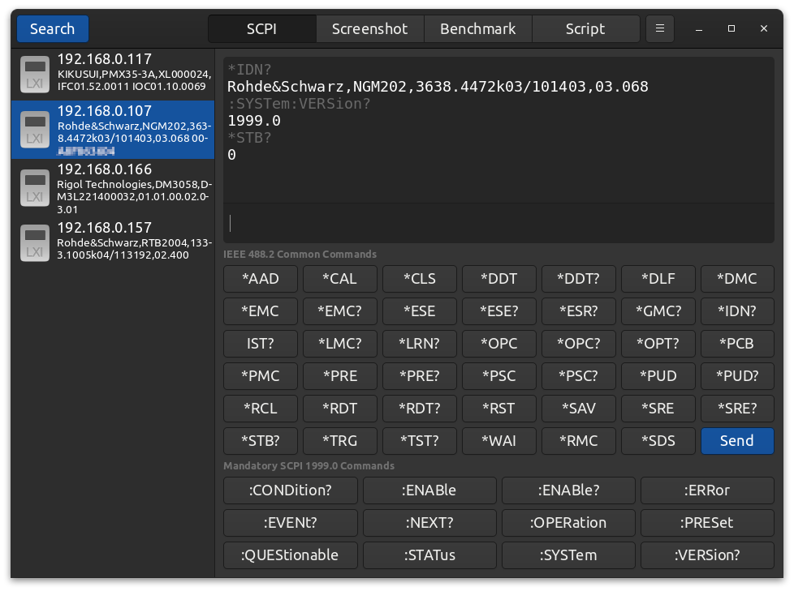
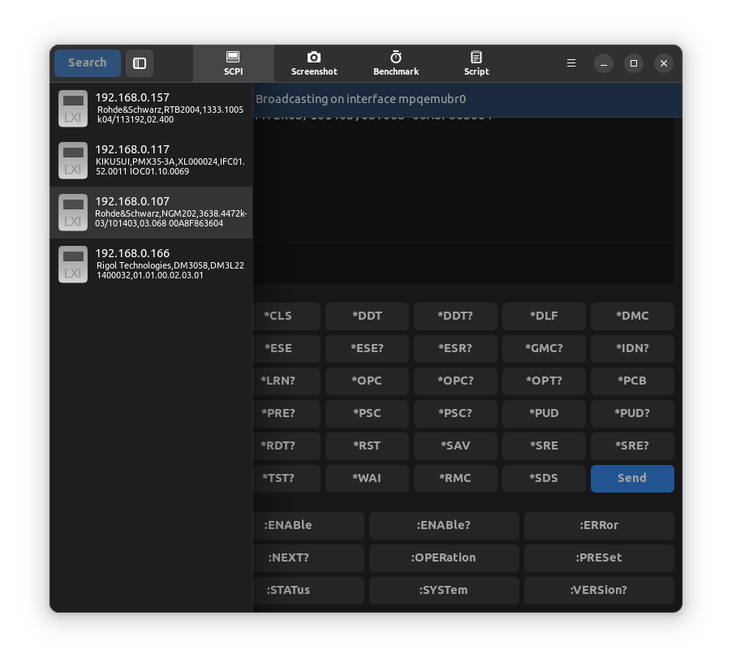
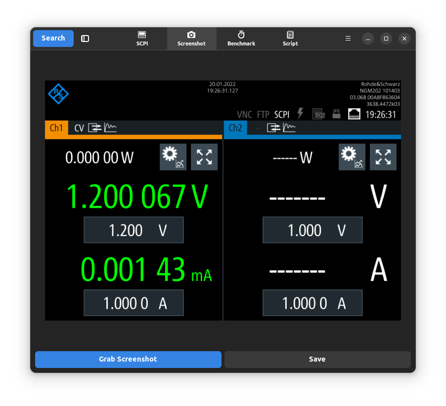
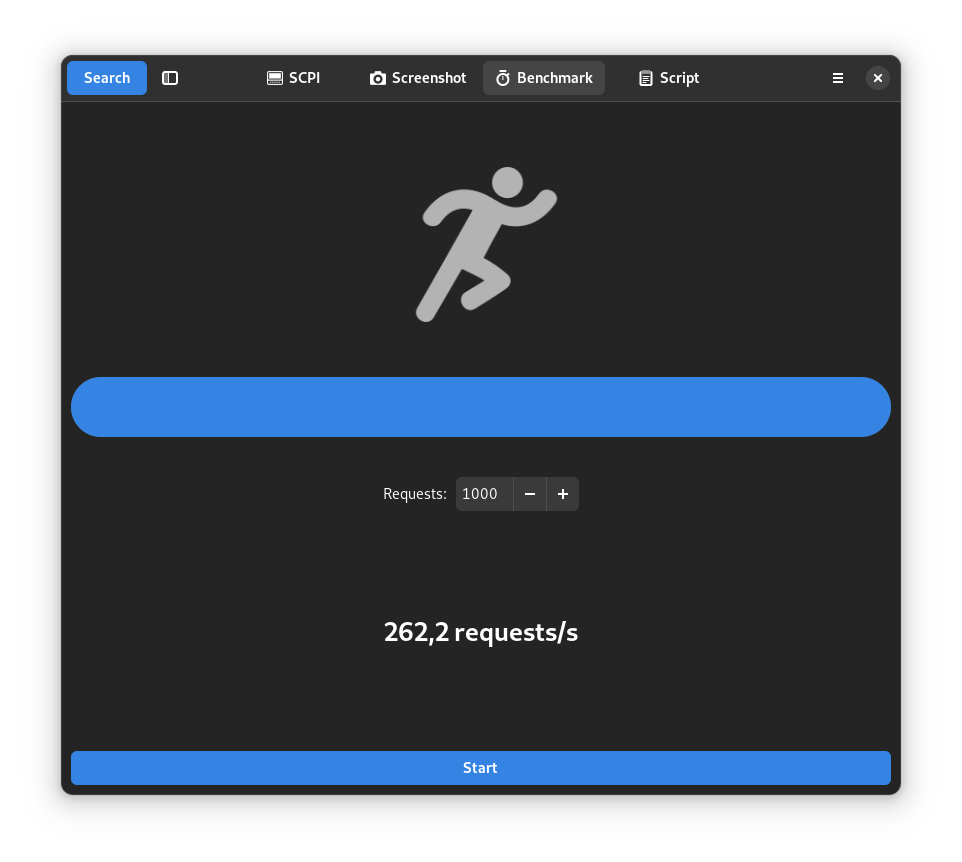
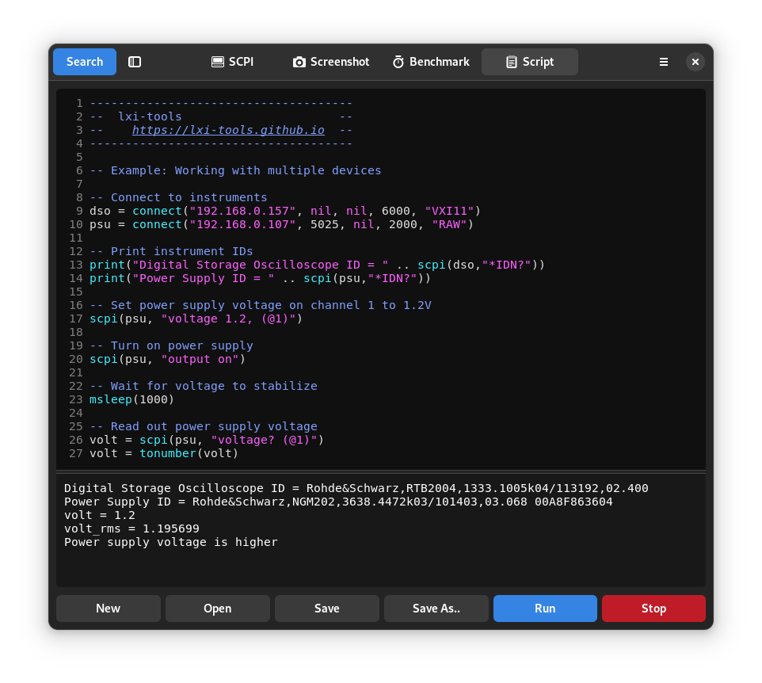

[]()

# lxi-tools - open source LXI tools

[](https://circleci.com/gh/lxi-tools/lxi-tools/tree/master)
[](https://github.com/lxi-tools/lxi-tools/releases)
[](https://repology.org/project/lxi-tools/versions)
[](https://www.codefactor.io/repository/github/lxi-tools/lxi-tools)
<!-- [](https://github.com/lxi-tools/lxi-tools) -->

## 1. Introduction

lxi-tools are open source software tools for managing network attached LXI
compatible test instruments such as modern oscilloscopes, power supplies,
spectrum analyzers etc.

Features include automatic discovery of test instruments, sending SCPI
commands, grabbing screenshots from supported instruments, benchmarking SCPI
message performance, and powerful scripting for test automation. Both a
commandline tool and a GUI tool are available.

lxi-tools rely on [liblxi](https://github.com/lxi-tools/liblxi) for all
communication.

### 1.1 What is LXI?

LAN eXtensions for Instrumentation (LXI) is a standard developed by the LXI
Consortium, an industry consortium that maintains the LXI specification and
promotes the LXI Standard. The LXI standard defines the communication protocols
for modern instrumentation and data acquisition systems using Ethernet.

Visit www.lxistandard.org for more details.

Please notice that lxi-tools is not affiliated with the LXI consortium - it is
an independent open source community effort.

### 1.2 Motivation

To make better and simpler open source tools for managing network attached LXI
compatible test instruments.

## 2. Features

 * Automatically discover test instruments on local network via VXI11 or mDNS
 * Send SCPI commands and receive responses
 * Automatically grab screenshots from supported instruments
 * Benchmark request/response performance of instruments
 * Support for manually adding instruments in case they are undiscoverable
 * Powerful Lua scripting support for advanced automation
   - Simple script editor with syntax highlighting
   - Simple API which supports
     - Connecting/disconnecting remote test instruments
     - Send SCPI commands to connected test instruments and receive responses
     - Clock sources for managing elapsed time
     - Log data to CSV files
     - Charts for graphically presenting captured data live in various chart types:
       - Line
       - Scatter
       - Number
       - Angular gauge
       - Linear gauge
     - Charts can be saved in PNG or CSV format
 * Command-line and GUI tool available
 * Interactive command-line mode
 * Dump received response in hexadecimal format

## 3. Usage

### 3.1 lxi-gui

The lxi-gui application provides some of the same features as the commandline
tool and more but presents them in a modern GUI frontend.

<p align="center">

<em>SCPI mode - easily explore SCPI features of your instruments</em>

<em>Search for instruments - using standard broadcast discovery or mDNS</em>

<em>Screenshot mode - easily grab display screenshots from supported instruments</em>

<em>Benchmark mode - measure the message response performance of your instruments</em>

<em>Script mode - program your LXI compatible instruments in a powerful clean cut Lua script environment</em>

<em>Script mode in action plotting voltage levels from a DC power supply to line chart and CSV/PNG files</em>
</p>

### 3.2 lxi

The commandline interface of the lxi application is described in the output
from 'lxi --help':
```
     Usage: lxi [--version] [--help] <command> [<args>]

       -v, --version                        Display version
       -h, --help                           Display help

     Commands:
       discover [<options>]                 Search for devices
       scpi [<options>] <scpi-command>      Send SCPI command
       screenshot [<options>] [<filename>]  Capture screenshot
       benchmark [<options>]                Benchmark
       run <filename>                       Run Lua script

     Discover options:
       -t, --timeout <seconds>              Timeout (default: 3)
       -m, --mdns                           Search via mDNS/DNS-SD

     Scpi options:
       -a, --address <ip>                   Device IP address
       -p, --port <port>                    Use port (default: VXI11: 111, RAW: 5025)
       -t, --timeout <seconds>              Timeout (default: 3)
       -x, --hex                            Print response in hexadecimal
       -i, --interactive                    Enter interactive mode
       -r, --raw                            Use raw/TCP

     Screenshot options:
       -a, --address <ip>                   Device IP address
       -t, --timeout <seconds>              Timeout (default: 15)
       -p, --plugin <name>                  Use screenshot plugin by name
       -l, --list                           List available screenshot plugins

     Benchmark options:
       -a, --address <ip>                   Device IP address
       -p, --port <port>                    Use port (default: VXI11: 111, RAW: 5025)
       -t, --timeout <seconds>              Timeout (default: 3)
       -c, --count <count>                  Number of request messages (default: 100)
       -r, --raw                            Use raw/TCP
```

#### 3.2.1 Example - Discover LXI devices on available networks

```
     $ lxi discover
     Searching for LXI devices - please wait...

     Broadcasting on interface lo
     Broadcasting on interface eth0
         Found "RIGOL TECHNOLOGIES,DS1104Z,DS1ZA1234567890,00.04.03.SP2" on address 10.42.1.20
         Found "RIGOL TECHNOLOGIES,DP831,DP8F1234567890,00.01.14" on address 10.42.1.67
     Broadcasting on interface wlan0

     Found 2 devices
```

#### 3.2.2 Example - Send SCPI command to an instrument

```
     $ lxi scpi --address 10.42.1.20 "*IDN?"
     RIGOL TECHNOLOGIES,DS1104Z,DS1ZA1234567890,00.04.03
```
To dump response to file simply do:
```
     $ lxi scpi --address 10.42.1.20 "*IDN?" > response.txt
```

#### 3.2.3 Example - Capture screenshot from a Rigol 1000z series oscilloscope

```
     $ lxi screenshot --address 10.42.1.20 --plugin rigol-1000z
     Saved screenshot image to screenshot_10.42.1.20_2017-11-11_13:45:47.png
```

Or using plugin autodetection simply:

```
     $ lxi screenshot --address 10.42.1.20
     Loaded rigol-1000 screenshot plugin
     Saved screenshot image to screenshot_10.42.1.20_2017-11-11_13:46:02.png
```

#### 3.2.4 Example - Capture screenshot and convert it to any image format

By default the format of the captured screenshot image is dictated by which
screenshot plugin and instrument are in play. However, it is possible to write
the screenshot image to stdout and pipe it directly to other tools for image
processing.

For example, use ImageMagicks convert tool to automatically convert any
screenshot image to JPG:

```
    $ lxi screenshot --address 10.42.1.20 - | convert - screenshot.jpg
```

#### 3.2.5 Example - List available screenshot plugins

```
     $ lxi screenshot --list
                 Name   Description
         keysight-ivx   Keysight InfiniVision 2000X/3000X series oscilloscope
               lecroy   LeCroy WavePro oscilloscopes
          rigol-1000z   Rigol DS/MSO 1000z series oscilloscope
           rigol-2000   Rigol DS/MSO 2000 series oscilloscope
         rigol-dg4000   Rigol DG 4000 series function generator
         rigol-dm3000   Rigol DM 3000 series digital multimeter
          rigol-dp800   Rigol DP 800 series power supply
            rigol-dsa   Rigol DSA 700/800 series spectrum analyzer
           rs-hmo1000   Rohde & Schwarz HMO 1000 series oscilloscope
      siglent-sdm3000   Siglent SDM 3000/3000X series digital multimeter
          siglent-sdg   Siglent SDG 1000X/2000X/6000X series waveform generator
          siglent-sds   Siglent SDS 1000X/2000X series oscilloscope
     siglent-ssa3000x   Siglent SSA 3000X series spectrum analyzer
       tektronix-2000   Tektronix DPO/MSO 2000 series oscilloscope (experimental)
```

#### 3.2.6 Example - Benchmark instrument request/response performance

```
     $ lxi benchmark --address 10.42.1.20
     Benchmarking by sending 100 ID requests. Please wait...
     Result: 24.7 requests/second
```

## 4. Installation

### 4.1 Installation using package manager (Linux)

lxi-tools comes prepackaged for various GNU/Linux distributions. Please consult
your package manager tool to find and install lxi-tools.

If you would like to see lxi-tools included in your favorite distribution,
please reach out to their package maintainers team.

### 4.2 Installation using snap (Linux)

Install latest stable version:
```
    $ snap install lxi-tools
```
Install bleeding edge:
```
    $ snap install lxi-tools --edge
```

### 4.3 Installation using homebrew (MacOS, Linux)

If you have [homebrew](http://brew.sh) installed:
```
$ brew install lxi-tools
```

### 4.4 Installation from source

The latest source releases can be found [here](https://github.com/lxi-tools/lxi-tools/releases).

To compile and install successfully from source you need to first install the
following dependencies:

 * liblxi
 * libreadline
 * liblua
 * libgtk
 * libadwaita
 * gtksourceview
 * bash-completion

Install steps:
```
    $ meson setup build
    $ meson compile -C build
    $ meson install -C build
```

See meson\_options.txt for which features to enable/disable.

Note: The meson install steps may differ depending on your specific system.

## 5. Tested instruments

The tools are tested to work successfully with the following LXI compatible
instruments:

| Instrument                        | Working features           | Note                          |
|-----------------------------------|----------------------------|-------------------------------|
| Chroma 63205A                     | [discover+scpi]            | Use RAW/TCP, port 2101        |
| ITECH IT6018C                     | [discover+scpi]            |                               |
| GW-INSTEK PSW800                  | [scpi]                     | Use RAW/TCP, port 2268        |
| Keysight Technologies AWG 33612A  | [discover+scpi+screenshot] |                               |
| Keysight Technologies DMM 34461A  | [discover+scpi+screenshot] |                               |
| Keysight Technologies DMM L4411A  | [discover+scpi]            |                               |
| Keysight Technologies MSO-X 3024T | [discover+scpi+screenshot] |                               |
| Keysight Technologies MSO-X 6004A | [discover+scpi+screenshot] |                               |
| Kikusui Electronics PMX35-3A      | [discover+scpi]            |                               |
| LeCroy WavePro ZI-a               | [discover+scpi+screenshot] |                               |
| Rigol Technologies DG1062Z        | [discover+scpi+screenshot] |                               |
| Rigol Technologies DG4062         | [discover+scpi+screenshot] |                               |
| Rigol Technologies DG4102         | [discover+scpi+screenshot] |                               |
| Rigol Technologies DG4162         | [discover+scpi+screenshot] |                               |
| Rigol Technologies DL3021         | [discover+scpi]            |                               |
| Rigol Technologies DP831          | [discover+scpi+screenshot] |                               |
| Rigol Technologies DP832          | [discover+scpi+screenshot] |                               |
| Rigol Technologies DM3058         | [discover+scpi]            |                               |
| Rigol Technologies DM3068         | [discover+scpi+screenshot] |                               |
| Rigol Technologies DS1074Z+       | [discover+scpi+screenshot] |                               |
| Rigol Technologies DS1104Z        | [discover+scpi+screenshot] |                               |
| Rigol Technologies DS2302         | [discover+scpi+screenshot] |                               |
| Rigol Technologies DSA815         | [discover+scpi+screenshot] |                               |
| Rigol Technologies MSO1104Z       | [discover+scpi+screenshot] |                               |
| Rigol Technologies MSO2302A       | [discover+scpi+screenshot] |                               |
| Rigol Technologies MSO4024        | [discover+scpi+screenshot] |                               |
| Rigol Technologies MSO4054        | [discover+scpi+screenshot] |                               |
| Rigol Technologies MSO5074        | [discover+scpi+screenshot] |                               |
| Rohde & Schwarz CMW 270           | [discover+scpi]            |                               |
| Rohde & Schwarz HMC 8012          | [discover+scpi+screenshot] |                               |
| Rohde & Schwarz HMC 8043          | [discover+scpi+screenshot] |                               |
| Rohde & Schwarz HMO 1202          | [discover+scpi+screenshot] |                               |
| Rohde & Schwarz HMO 3054          | [scpi+screenshot]          |                               |
| Rohde & Schwarz NGE 100           | [discover+scpi+screenshot] |                               |
| Rohde & Schwarz NGM 202           | [discover+scpi+screenshot] |                               |
| Rohde & Schwarz NGL 202           | [discover+scpi+screenshot] |                               |
| Rohde & Schwarz RTB 2004          | [discover+scpi+screenshot] |                               |
| Rohde & Schwarz RTH 1004          | [discover+scpi+screenshot] |                               |
| Rohde & Schwarz RTM 3004          | [discover+scpi+screenshot] |                               |
| Rohde & Schwarz ZNL3              | [discover+scpi]            |                               |
| Siglent Technologies SDG1032X     | [discover+scpi+screenshot] |                               |
| Siglent Technologies SDG2122X     | [discover+scpi+screenshot] |                               |
| Siglent Technologies SDG2042X     | [discover+scpi+screenshot] |                               |
| Siglent Technologies SDG6052      | [discover+scpi+screenshot] |                               |
| Siglent Technologies SDS1152CML   | [discover+scpi+screenshot] |                               |
| Siglent Technologies SDS1202X-E   | [discover+scpi+screenshot] |                               |
| Siglent Technologies SDS1204X-E   | [discover+scpi+screenshot] |                               |
| Siglent Technologies SDS2304X     | [discover+scpi+screenshot] |                               |
| Siglent Technologies SDM3045X     | [discover+scpi+screenshot] |                               |
| Siglent Technologies SDM3055      | [discover+scpi+screenshot] |                               |
| Siglent Technologies SDM3055-SC   | [discover+scpi+screenshot] |                               |
| Siglent Technologies SDM3065X     | [discover+scpi+screenshot] |                               |
| Siglent Technologies SPD1168X     | [scpi]                     |                               |
| Siglent Technologies SPD3303X-E   | [scpi]                     |                               |
| Siglent Technologies SSA3032X     | [discover+scpi+screenshot] |                               |
| Tektronix TDS3034B                | [discover+scpi+screenshot] |                               |
| Tektronix MDO3024                 | [discover+scpi]            |                               |
| Tektronix 4 Series MSO            | [discover+scpi]            |                               |
| Tektronix MSO56                   | [discover+scpi+screenshot] |                               |

Notes:
 * Feel free to add tested instruments to the list via GitHub pull request or report via GitHub issue.
 * The [lxi-tools wiki](https://github.com/lxi-tools/lxi-tools/wiki/) provides further information regarding test instruments, including known issues and SCPI commands.

## 6. Documentation

## 6.1 lxi

The lxi commandline tool is documented in its included manpages.

## 6.2 Lua script API

The lxi-tools Lua script API is documented [here](doc/lua-api.txt).

## 7. Contributing

lxi-tools is open source. If you want to help out with the project please feel
free to join in.

All contributions (bug reports, code, doc, ideas, etc.) are welcome.

Please use the github issue tracker and pull request features.

Also, if you find this free open source software useful please feel free to
consider making a donation of your choice:

[](https://www.paypal.me/lundmar)

## 8. Support

Submit bug reports [here](https://github.com/lxi-tools/lxi-tools/issues).

## 9. Website

Visit [lxi-tools.github.io](https://lxi-tools.github.io)

## 10. Wiki

Visit wiki [here](https://github.com/lxi-tools/lxi-tools/wiki/).

## 11. License

This code is released under BSD-3, commonly known as the 3-clause (or
"modified") BSD license.

## 12. Authors

Created and maintained by Martin Lund \<martin.lund@keep-it-simple.com>

See the AUTHORS file for full list of contributors.

## 13. Sponsors

A big thank you to the following sponsors that have donated test equipment to
support the lxi-tools open source effort:

 * Siglent Technologies - www.siglent.com
 * KIKUSUI Electronics Corp. - www.kikusui.co.jp

