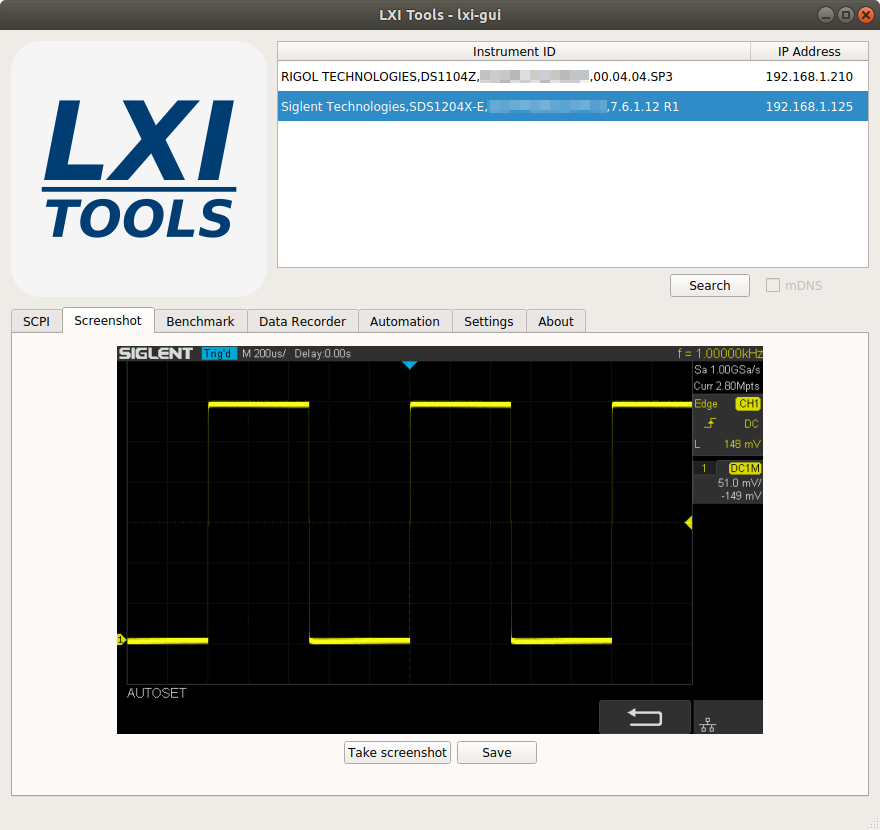

# lxi-tools

[](https://travis-ci.org/lxi-tools/lxi-tools)
[](https://build.snapcraft.io/user/lxi-tools/lxi-tools.snapcraft)

## 1. Introduction

lxi-tools is a collection of open source software tools that enables control of
LXI compatible instruments such as modern oscilloscopes, power supplies,
spectrum analyzers etc.

All features are consolidated in the 'lxi' application which provides a simple
commandline interface to discover LXI instruments, send SCPI commands, and
capture screenshots from supported LXI instruments.

Also provided is a GUI application which provide some of the features of the
commandline tool.

lxi-tools rely on liblxi for all communication.


## 2. Usage

### 2.1 lxi-gui (BETA)

<p align="center">

</p>

The lxi-gui application provides some of the same features as the commandline
tool but presents them in a GUI frontend.

### 2.2 lxi

The commandline interface of the lxi application is described in the output
from 'lxi --help':
```
     Usage: lxi [--version] [--help] <command> [<args>]

       -v, --version                        Display version
       -h, --help                           Display help

     Commands:
       discover [<options>]                 Search for LXI devices
       scpi [<options>] <scpi-command>      Send SCPI command
       screenshot [<options>] [<filename>]  Capture screenshot
       benchmark [<options>]                Benchmark

     Discover options:
       -t, --timeout <seconds>              Timeout (default: 3)
       -m, --mdns                           Search via mDNS/DNS-SD

     Scpi options:
       -a, --address <ip>                   Device IP address
       -p, --port <port>                    Use port (default: VXI11: 111, RAW: 5025)
       -t, --timeout <seconds>              Timeout (default: 3)
       -x, --hex                            Print response in hexadecimal
       -i, --interactive                    Enter interactive mode
       -s, --script <filename>              Run script file
       -r, --raw                            Use raw/TCP

     Screenshot options:
       -a, --address <ip>                   Device IP address
       -t, --timeout <seconds>              Timeout (default: 15)
       -p, --plugin <name>                  Use screenshot plugin by name
       -l, --list                           List available screenshot plugins

     Benchmark options:
       -a, --address <ip>                   Device IP address
       -p, --port <port>                    Use port (default: VXI11: 111, RAW: 5025)
       -t, --timeout <seconds>              Timeout (default: 3)
       -c, --count <count>                  Number of request messages (default: 100)
       -r, --raw                            Use raw/TCP
```

#### 2.2.1 Example - Discover LXI devices on available networks

```
     $ lxi discover
     Searching for LXI devices - please wait...

     Broadcasting on interface lo
     Broadcasting on interface eth0
         Found "RIGOL TECHNOLOGIES,DS1104Z,DS1ZA1234567890,00.04.03.SP2" on address 10.42.1.20
         Found "RIGOL TECHNOLOGIES,DP831,DP8F1234567890,00.01.14" on address 10.42.1.67
     Broadcasting on interface wlan0

     Found 2 devices
```

#### 2.2.2 Example - Send SCPI command to an instrument

```
     $ lxi scpi --address 10.42.1.20 "*IDN?"
     RIGOL TECHNOLOGIES,DS1104Z,DS1ZA1234567890,00.04.03
```
To dump response to file simply do:
```
     $ lxi scpi --address 10.42.1.20 "*IDN?" > response.txt
```

#### 2.2.3 Example - Capture screenshot from a Rigol 1000z series oscilloscope

```
     $ lxi screenshot --address 10.42.1.20 --plugin rigol-1000z
     Saved screenshot image to screenshot_10.42.1.20_2017-11-11_13:45:47.png
```

Or using plugin autodetection simply:

```
     $ lxi screenshot --address 10.42.1.20
     Loaded rigol-1000 screenshot plugin
     Saved screenshot image to screenshot_10.42.1.20_2017-11-11_13:46:02.png
```

#### 2.2.4 Example - Capture screenshot and convert it to any image format

By default the format of the captured screenshot image is dictated by which
screenshot plugin and instrument are in play. However, it is possible to write
the screenshot image to stdout and pipe it directly to other tools for image
processing.

For example, use ImageMagicks convert tool to automatically convert screenshot
image to JPG:

```
    $ lxi screenshot --address 10.42.1.20 - | convert - screenshot.jpg
```

#### 2.2.5 Example - List available screenshot plugins

```
     $ lxi screenshot --list
                 Name   Description
         keysight-ivx   Keysight InfiniVision 2000X/3000X series oscilloscope
          rigol-1000z   Rigol DS/MSO 1000z series oscilloscope
           rigol-2000   Rigol DS/MSO 2000 series oscilloscope
         rigol-dg4000   Rigol DG 4000 series function generator
         rigol-dm3000   Rigol DM 3000 series digital multimeter
          rigol-dp800   Rigol DP 800 series power supply
            rigol-dsa   Rigol DSA 700/800 series spectrum analyzer
           rs-hmo1000   Rohde & Schwarz HMO 1000 series oscilloscope
      siglent-sdm3000   Siglent SDM 3000/3000X series digital multimeter
          siglent-sdg   Siglent SDG 1000X/2000X/6000X series waveform generator
          siglent-sds   Siglent SDS 1000X/2000X series oscilloscope
     siglent-ssa3000x   Siglent SSA 3000X series spectrum analyzer
       tektronix-2000   Tektronix DPO/MSO 2000 series oscilloscope (experimental)
```

#### 2.2.6 Example - Benchmark instrument request/response performance

```
     $ lxi benchmark --address 10.42.1.20
     Benchmarking by sending 100 ID requests. Please wait...
     Result: 24.7 requests/second
```

## 3. Installation

The latest release version can be downloaded from https://lxi-tools.github.io

### 3.1 Installation using source

To compile and install successfully from source you need to install the
following dependencies:

 * liblxi
 * lua
 * Qt5Core     (optional)
 * Qt5Gui      (optional)
 * Qt5Widgets  (optional)
 * Qt5Charts   (optional)

Install steps:
```
    $ ./configure
    $ make
    $ make install
```

Note: Please do no try to install from source if you are not familiar with
using autotools.

Note: If you are installing from git source remember to run the autogen.sh
script to generate the configure script.

### 3.2 Installation using package

lxi-tools comes prepackaged for various GNU/Linux distributions. Visit
https://lxi-tools.github.io to see list of supported distributions.

## 4. Tested instruments

The commandline lxi tool is tested to work successfully with the following LXI
compatible instruments:

| Instrument                        | Working features           |
|-----------------------------------|----------------------------|
| Keysight Technologies AWG 33612A  | (discover+scpi+screenshot) |
| Keysight Technologies DMM 34461A  | (discover+scpi+screenshot) |
| Keysight Technologies MSO-X 3024T | (discover+scpi+screenshot) |
| Kikusui Electronics PMX35-3A      | (discover+scpi)            |
| Rigol Technologies DG4062         | (discover+scpi+screenshot) |
| Rigol Technologies DG4102         | (discover+scpi+screenshot) |
| Rigol Technologies DG4162         | (discover+scpi+screenshot) |
| Rigol Technologies DP831          | (discover+scpi+screenshot) |
| Rigol Technologies DP832          | (discover+scpi+screenshot) |
| Rigol Technologies DM3068         | (discover+scpi+screenshot) |
| Rigol Technologies DS1104Z        | (discover+scpi+screenshot) |
| Rigol Technologies DS2302         | (discover+scpi+screenshot) |
| Rigol Technologies DSA815         | (discover+scpi+screenshot) |
| Rigol Technologies MSO1104Z       | (discover+scpi+screenshot) |
| Rigol Technologies MSO2302A       | (discover+scpi+screenshot) |
| Rigol Technologies MSO5074        | (discover+scpi+screenshot) |
| Rohde & Schwarz HMC 8012          | (discover+scpi+screenshot) |
| Rohde & Schwarz HMC 8043          | (discover+scpi+screenshot) |
| Rohde & Schwarz HMO 1202          | (discover+scpi+screenshot) |
| Rohde & Schwarz HMO 3054          | (scpi+screenshot)          |
| Rohde & Schwarz RTB 2004          | (discover+scpi+screenshot) |
| Rohde & Schwarz NGE 100           | (discover+scpi+screenshot) |
| Siglent Technologies SDG1032X     | (discover+scpi+screenshot) |
| Siglent Technologies SDG2122X     | (discover+scpi+screenshot) |
| Siglent Technologies SDG6052      | (discover+scpi+screenshot) |
| Siglent Technologies SDS1202X-E   | (discover+scpi+screenshot) |
| Siglent Technologies SDS1204X-E   | (discover+scpi+screenshot) |
| Siglent Technologies SDS2304X     | (discover+scpi+screenshot) |
| Siglent Technologies SDM3045X     | (discover+scpi+screenshot) |
| Siglent Technologies SDM3055      | (discover+scpi+screenshot) |
| Siglent Technologies SDM3065X     | (discover+scpi+screenshot) |
| Siglent Technologies SPD3303X-E   | (scpi)                     |
| Siglent Technologies SSA3032X     | (discover+scpi+screenshot) |

Note: Feel free to add your instrument(s) to the list via GitHub pull request
or simply create a GitHub issue reporting your instrument(s) and which features
work.

## 5. Contributing

lxi-tools is open source. If you want to help out with the project please join
in.

All contributions (bug reports, code, doc, ideas, etc.) are welcome.

Please use the github issue tracker and pull request features.

Also, if you find this free open source software useful please consider making
a donation:

[](https://www.paypal.me/lundmar)

## 6. Website

Visit https://lxi-tools.github.io

## 7. License

This code is released under BSD-3, commonly known as the 3-clause (or
"modified") BSD license.

## 8. Authors

Created and maintained by Martin Lund \<martin.lund@keep-it-simple.com>

See the AUTHORS file for full list of authors.

## 9. Sponsors

A thank you to the following sponsors that have donated test equipment to
support the lxi-tools open source effort:

 * Siglent Technologies
 * KIKUSUI Electronics Corp.

